<!-- Header -->
<h1 align="center"><a href="https://github.com/UdhavPawar/TypeRacerBot">Type Racer Bot</a></h1>
<!-- Description -->
<h3 align="center">Win every <a href="https://play.typeracer.com/" target="_blank">typing</a> race with 200+ words per minute</h3>

<!-- Labels -->
<p align="center">
  
  
  
  
</p>

<!-- Jumpers -->
<p align="center">
  <a href="#how-it-works">How it works</a> •
  <a href="#installation">Installation</a> •
  <a href="#how-to-use">How To Use</a> •
  <a href="#contributing">Contribute</a>
</p>

## How it works
```
1. Using pynput.mouse we get co-ordinates (pixels) of selected screen using mouse
2. Next an in-place (not saved locally) screenshot is captured of those pixels using pyscreenshot.grab
3. This screenshot acts as input for pytesseract.image_to_string function which converts image to string
4. We polish the output string and text is now ready to be typed
5. Finally we simulate typing of this string using pynput.keyboard which will iterate over every character in string and type it out
```
> below is bot typing a practice test

https://user-images.githubusercontent.com/28740403/162593493-601887de-c133-4501-a76e-eb28419d7747.mov


## Installation
> git clone repo



## How To Use
Usage is pretty simple as following:
1. Start the bot by running command `python3 bot.py`
2. Using your mouse draw a rectangle around text as shown below


3. Bot will show text it has converted from image to text and ready to type
4. Place your cursor where you want to type and hit _backspace_ key
> below is bot winning 🏆 a real-time multi-player typing race 🏎️

https://user-images.githubusercontent.com/28740403/162593498-32e26174-5e7f-463b-875e-bd325b755713.mov

> note: you can manipulate bot's typing speed by updating it's typing [delay](https://github.com/UdhavPawar/TypeRacerBot/blob/master/bot.py#L35) [Default: 200+ WPM]

## Contributing
Pull requests are welcome. For major changes, please open an issue first to discuss what you would like to change/fix.

## License
[MIT](https://github.com/UdhavPawar/TypeRacerBot/blob/master/LICENSE)

## Other Projects
Checkout my [portfolio](https://udhavpawar.com/) to learn more about this and other projects
